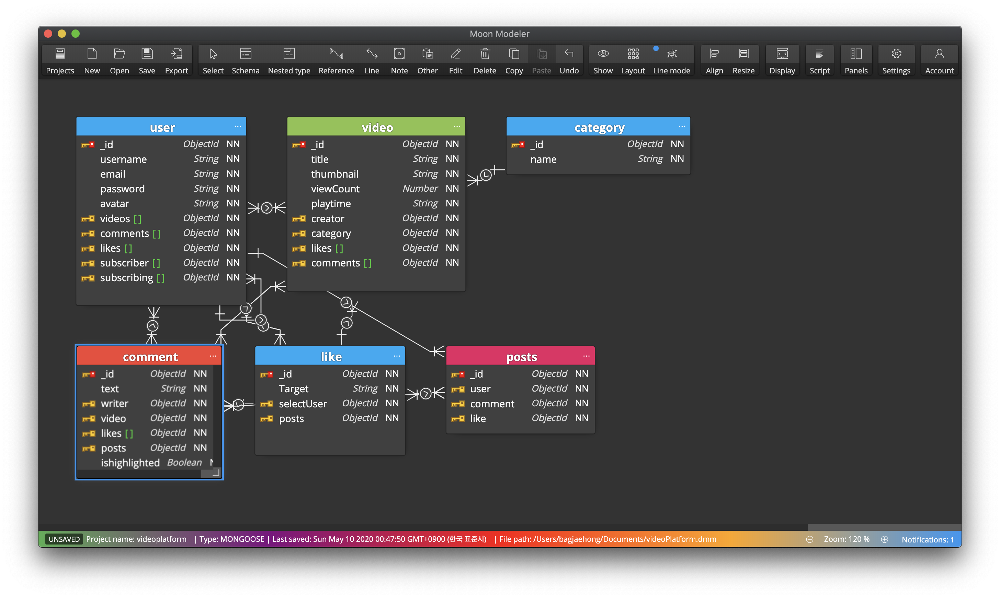

# videoPlatform
유튜브 클론코딩 + 동영상스트리밍( node js + mongodb + graphql + react + reactNative)

## 진행 기록
1. graphql 기본 세팅 설정 (2020.5.9)
2. mongodb 연결 (2020.5.9)
3. database model 디자인 (2020.5.10)
## 개발 순서
1. graphql nodejs 기본 셋팅 [O]
2. 몽고디비 연결 [O]
3. 모델 생성 [x]

# 모데링

