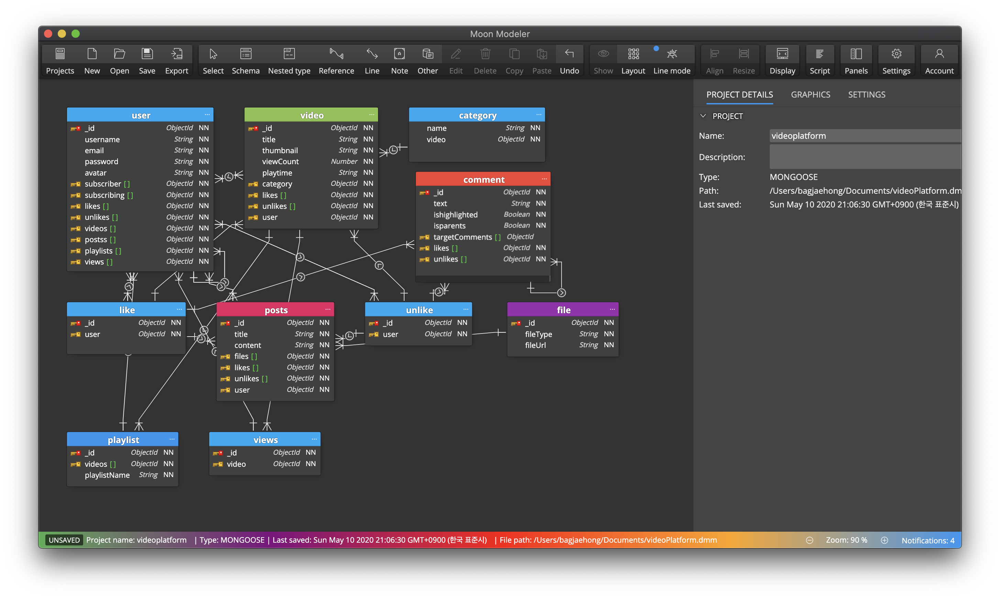

# videoPlatform
유튜브 클론코딩 + 동영상스트리밍( node js + mongodb + graphql + react + reactNative)

# api 기능 리스트
1.  [User]  회원가입 - createAccount
2.  [User]  이메일인증 - requestSecret #랜덤 문자열 전송
3.  [User]  로그인 - loginUser
4.  [User]  사용자 정보 변경 - editProfile
5.  [User]  비밀번호 찾기 - findPassword
6.  [User]  계정 삭제 - deleteUser
0.  [User]  사용자(채널)조회 - searchUser
0.  [User]  채널구독/취소 - subscribeUser #toggle 
0.  [Video] 동영상조회 - searchVideo
7.  [Video] 동영상업로드 - uploadVideo
8.  [Video] 동영상삭제 - deleteVideo
9.  [Video] 동영상수정 - editVideo # 동영상 재업로드 불가
10. [Playlist] 재생목록추가 - addPlayList
11. [Playlist] 재생목록삭제 - deletePlayList
12. [Playlist] 재생목록수정 - editPlayList
13. [Playlist] 재생목록조회 - searchPlayList
14. [Like] 좋아요 - like 
15. [UnLike] 싫어요  - unlike
16. [Comment] 댓글달기 - addComment
17. [Comment] 댓글삭제 - removeComment
18. [Comment] 댓글수정 - editComment

## 진행 기록
1. graphql 기본 세팅 설정 (2020.5.9)
2. mongodb 연결 (2020.5.9)
3. database model 디자인 (2020.5.10)
## 개발 순서
1. graphql nodejs 기본 셋팅 [O]
2. 몽고디비 연결 [O]
3. 모델 생성 [x]

# 데이터베이스 모델링

